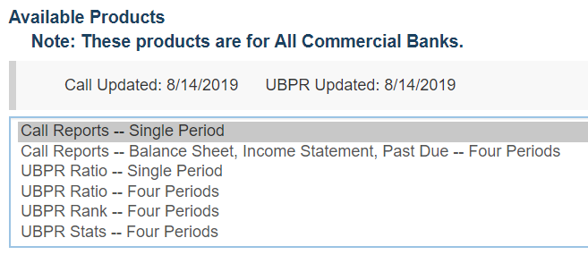
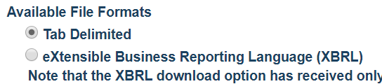
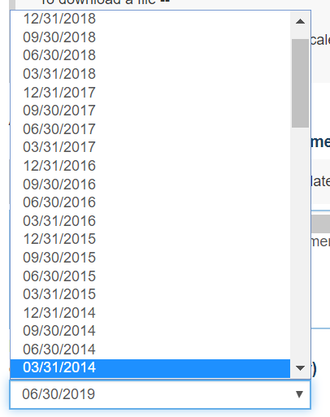
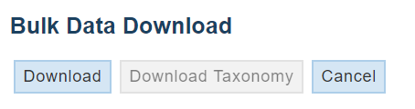

# Real-bulk download Call Reports from FFIEC

This Python CLI program automates a Google Chrome window to access the [FFIEC's Central Data Repository public website](https://cdr.ffiec.gov/public/PWS/DownloadBulkData.aspx).
I need this data for research purposes.
The FFIEC has a SOAP interface that can be used by registered users.
However, it is limited in scope because it does not allow to download **all** call reports publicly available at once.
It essentially just allows to replicate the actions that can be manually performed in a browser, loading their webpage.
Not really useful.
On top of this, I am an extremely lazy researcher that totally cannot afford to manually click on all options in a HTML drop-down menu that populates a AJAX request.
Hence this program.

## Main steps of the program

This is a screenshot of the website that stood in my way.

It looks like a pretty easy static HTML webpage, but it is not.
As you click elements in the page, there is some Javascript code that runs in the background.
Such Javascript code silently compiles a POST request that is sent to an AJAX server.
And this is evil.
The POST request is populated with a random (to me) string that makes the returned content a puzzle (to me) to solve.
This meant (to me) that I could not create my own POST requests in Python or R, and I had to go the dirty way.

My program procedes in the following steps.

First, it opens the webpage on a new, automated Chrome window. Pretty easy. You should notice, somewhere in my code I've put the following lines:

Then, it looks for the set of options under the "_Available Products_" header.*
It then emulates a selection (as triggered by a human click) on the option labelled "_Call Reports -- Single Period_."

* It's not really a [header](https://www.w3schools.com/tags/tag_header.asp), it's a [`
`](https://www.w3schools.com/tags/tag_div.asp) with a [`<label>`](https://www.w3schools.com/tags/tag_label.asp) tag, which got the web-developer a place in hell.

It ensures that the [radio button](https://en.wikipedia.org/wiki/Radio_button) related to the TSV export option is selected under "_Available File Formats_".

It retrieves _all_ available options in the drop-down menu under "_Reporting Period End Date_."

Finally, one by one, it selects each of the available dates and clicks on the Download button near the top of the page.

Note that this starts a series of _many_, potentially _big_ downloads.
Make sure you are not on a metered connection and you are not in a rush to power off/put to sleep your machine.

The result is a bunch of .zip files in your Downloads directory (or whatever default location you have for your downloads in your browser).

## Dependencies

- [Python 3](https://www.python.org)
- [Selenium](https://www.seleniumhq.org)
- [Google Chrome](https://www.google.com/chrome/)
- [ChromeDriver](https://chromedriver.chromium.org/)

My setup is on a Windows 10 machine.
I use [Anaconda](https://www.anaconda.com/) as package manager for Python.
I ran

    conda install selenium

and, together with Chrome and ChromeDriver, I was good to go.

## Read this before using this program

If you want to use the Python program in this repository, you should be aware of some things.

First, check out my [license](./LICENSE).

Second, you may want to use a webdriver for a browser that is not Chrome.
In such case, check out the [instructions provided by Selenium (for Python)](https://selenium-python.readthedocs.io/installation.html#drivers).

Third, executing my code "as is" may download a large amount of data and may get your (automated) browser stuck for some time.

Fourth, while this program automates a browser and executes instructions that a human may otherwise perform manually, this program has not been explicitly approved by the FFIEC.
This means that it may violate the fine prints at the end of the [webpage in question](https://cdr.ffiec.gov/public/PWS/DownloadBulkData.aspx) and that I report here verbatim.
> This is a protected U.S. Government web site. To intentionally cause damage to it or to any FFIEC or agency electronic facility or data through the knowing transmission of any program, information, code, or command is unlawful. This system and related equipment are subject to monitoring. Information regarding users may be obtained and disclosed to authorized personnel, including law enforcement authorities, for official purposes. Access to or use of this web site constitutes consent to these terms.

Finally, I am in no way affiliated to the FFIEC or the US Government.
I am just a poor researcher in need of data.

## Usage

From the command line (either cmd, powershell or bash):

    python ./download_call_reports.py [chromedriver-location]

The optional parameter `[chromedriver-location]` is the (full or absolute) path to the Chrome Driver executable on your machine.
You need to specify this parameter if the Chrome Driver executable is not on your PATH.

## Known issues

The program does not close the automated browser window upon completion of the tasks.
The major difficulty here is that Selenium [has (currently) no way of checking whether all downloads completed](https://stackoverflow.com/a/34338926).

## Resources

These should be helpful in case you want to understand my code (I might have used some of these myself...)

- [Selenium: Documentation for Python bindings](https://selenium-python.readthedocs.io/)
- [Stack Overflow: Listing select option values with Selenium and Python](https://stackoverflow.com/questions/18515692/listing-select-option-values-with-selenium-and-python)
- [Stack Overflow: How to select a drop-down menu option value with Selenium (Python)](https://stackoverflow.com/questions/7867537/how-to-select-a-drop-down-menu-option-value-with-selenium-python)
- [Stack Overflow: python selenium, find out when a download has completed?](https://stackoverflow.com/questions/34338897/python-selenium-find-out-when-a-download-has-completed)
- [Stack Overflow: Wait till download is complete in Python+Selenium+Firefox](https://stackoverflow.com/questions/47759491/wait-till-download-is-complete-in-pythonseleniumfirefox)
- [Stack Overflow: How to close the browser after completing a download?](https://stackoverflow.com/questions/21217087/how-to-close-the-browser-after-completing-a-download/)
